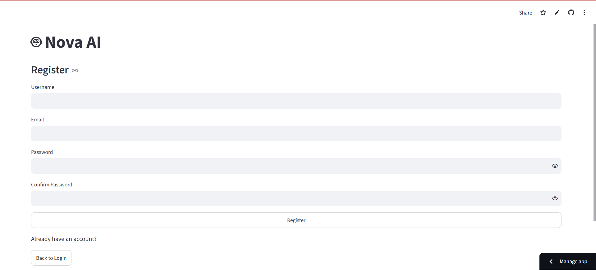
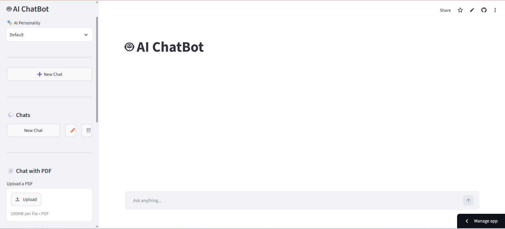
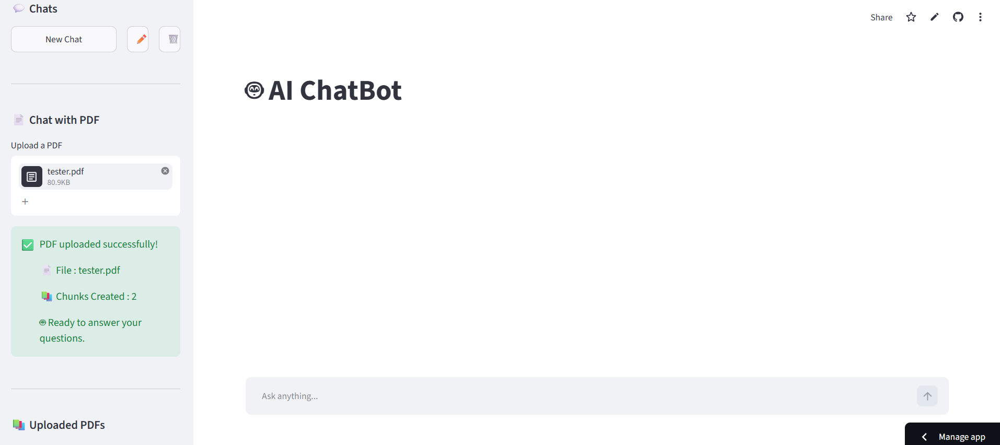
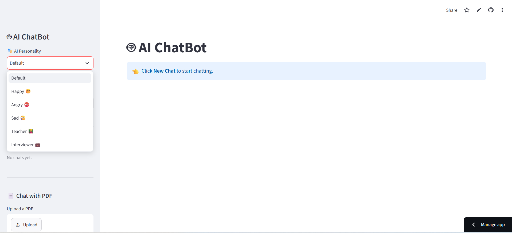

# 🤖 Nova AI ChatBot

An AI-powered chatbot built using **Streamlit**, **Mistral AI**, **LangChain**, and **FAISS**. This chatbot provides an intelligent conversational experience with secure user authentication, PDF-based Question Answering (RAG), AI personalities, web search, persistent chat history, and conversation memory.

---

## 🌐 Live Demo

🚀 **Try Nova AI ChatBot Here**

https://ai-chatbot-ampmwujtcjwkxgjzbnkeup.streamlit.app/#nova-ai

# ✨ Features

- 🔐 Secure User Registration & Login
- 🔒 Password Encryption using **bcrypt**
- 💬 Persistent Chat History
- ✏️ Rename Existing Chats
- 🗑️ Delete Chats
- 📄 Upload PDF Documents
- 🤖 AI-powered PDF Question Answering (RAG)
- 🌐 Real-time Web Search using Tavily API
- 🧠 AI Conversation Memory
- 🎭 Multiple AI Personalities
  - 😊 Happy
  - 😡 Angry
  - 😢 Sad
  - 👨‍🏫 Teacher
  - 💼 Interviewer
  - 🤖 Default Assistant
- ⚡ Streaming AI Responses
- 🗄️ SQLite Database
- 🎨 Clean & Responsive Streamlit UI

---

# 🛠️ Tech Stack

| Category | Technologies |
|----------|--------------|
| Frontend | Streamlit |
| Backend | Python |
| AI Model | Mistral AI |
| Framework | LangChain |
| Vector Database | FAISS |
| Embeddings | HuggingFace Sentence Transformers |
| Database | SQLite + SQLAlchemy |
| Authentication | bcrypt |
| PDF Processing | PyPDF, LangChain |
| Web Search | Tavily Search API |

---

# 📂 Project Structure

```
AI-ChatBot/
│
├── ai/
├── auth/
├── components/
├── database/
├── data/
├── services/
├── uploads/
├── utils/
├── vectorstore/
├── screenshots/
│   ├── register.png
│   ├── home.png
│   ├── pdf_upload.png
│   ├── settings.png
│
├── app.py
├── router.py
├── config.py
├── requirements.txt
├── .gitignore
└── README.md
```

---

# 📸 Screenshots


## 📝 Register Page



---

## 💬 AI Chat Interface



---

## 📄 PDF Upload



---

## ⚙️ Settings & AI Personalities



---

# ⚙️ Installation

## Clone Repository

```bash
git clone https://github.com/Rajarahulkr/AI-ChatBot.git
```

Go to project directory

```bash
cd AI-ChatBot
```

---

## Create Virtual Environment

### Windows

```bash
python -m venv venv
```

Activate

```bash
venv\Scripts\activate
```

---

### Linux / macOS

```bash
python3 -m venv venv
source venv/bin/activate
```

---

## Install Dependencies

```bash
pip install -r requirements.txt
```

---

# 🔑 Environment Variables

Create a **.env** file inside the project directory.

```env
MISTRAL_API_KEY=YOUR_MISTRAL_API_KEY
TAVILY_API_KEY=YOUR_TAVILY_API_KEY
MODEL=mistral-small-latest
```

---

# ▶️ Run the Application

```bash
streamlit run app.py
```

The application will be available at:

```
http://localhost:8501
```

---

# 📄 PDF Question Answering (RAG)

The chatbot supports Retrieval-Augmented Generation (RAG).

Workflow:

1. Upload a PDF document.
2. Extract text from the PDF.
3. Split text into chunks.
4. Generate embeddings.
5. Store embeddings in FAISS.
6. Retrieve relevant chunks.
7. Generate context-aware answers using Mistral AI.

---

# 🌐 Web Search

The chatbot integrates with the **Tavily Search API** to fetch real-time information from the internet whenever needed.

---

# 🔒 Authentication

- User Registration
- User Login
- Password Hashing using bcrypt
- Secure Session Management
- SQLite Database Storage

Passwords are never stored in plain text.

---

# 🧠 AI Personalities

Users can switch between multiple personalities:

- 🤖 Default Assistant
- 😊 Happy Assistant
- 😡 Angry Assistant
- 😢 Sad Assistant
- 👨‍🏫 Teacher
- 💼 Interviewer

Each personality changes the chatbot's response style.

---

# 🚀 Future Improvements

- 🎙️ Voice Chat
- 🖼️ Image Upload & Analysis
- 🌙 Dark Mode
- 📥 Chat Export (PDF/Word)
- 🌍 Multi-language Support
- ☁️ PostgreSQL Support
- 🔗 Google Authentication

---

# 💻 Author

## Raja Rahul Kumar

### GitHub

https://github.com/Rajarahulkr

### LinkedIn

https://www.linkedin.com/in/raja-rahul-kumar-9a150725b/

---

# ⭐ Support

If you like this project, please consider giving it a ⭐ Star on GitHub.

It motivates me to build more AI-powered open-source projects.

---
